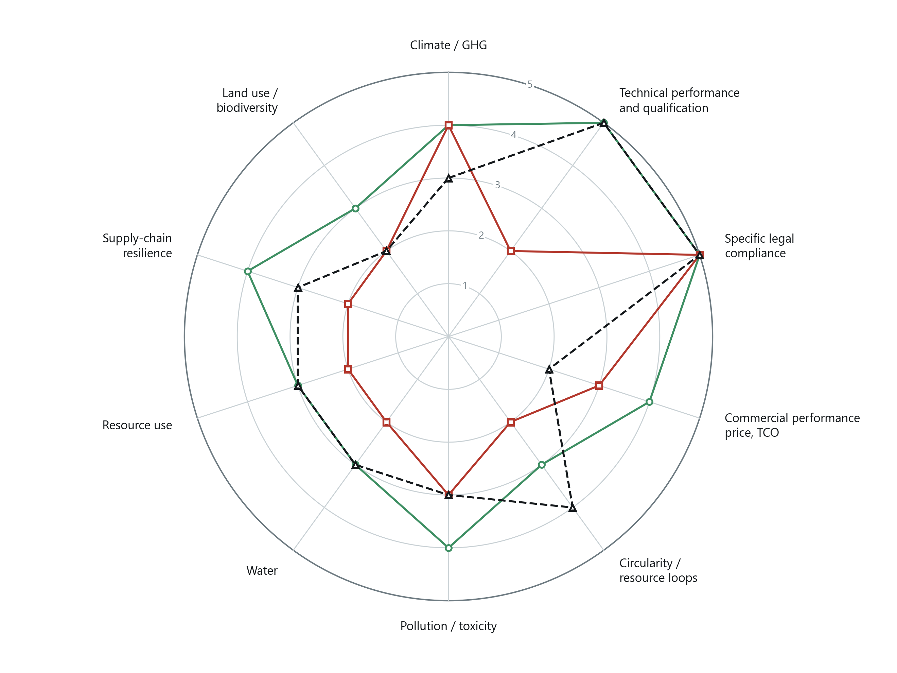
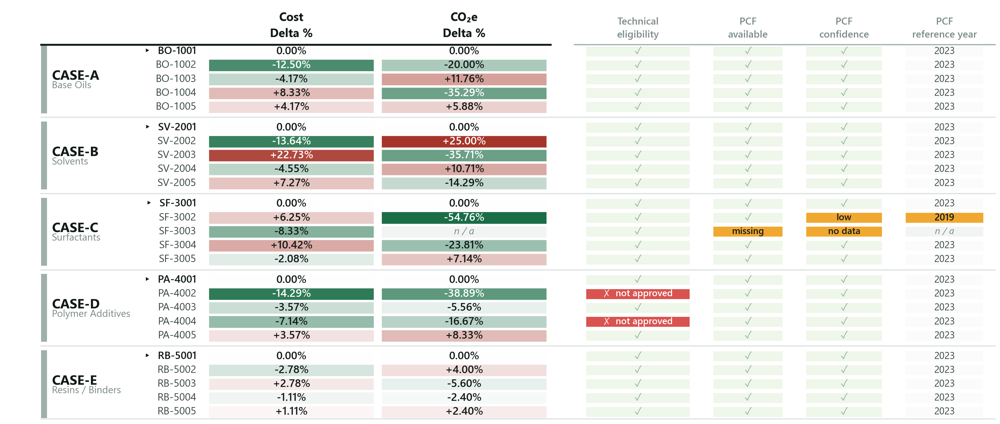
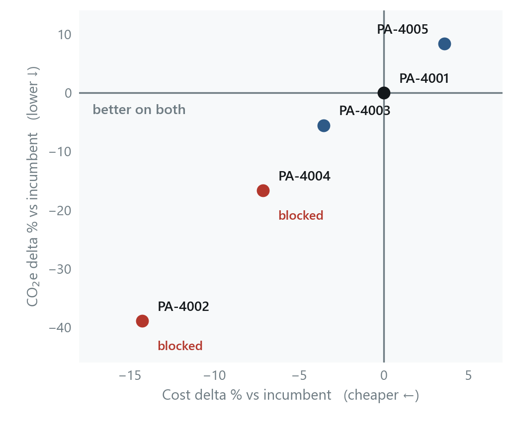
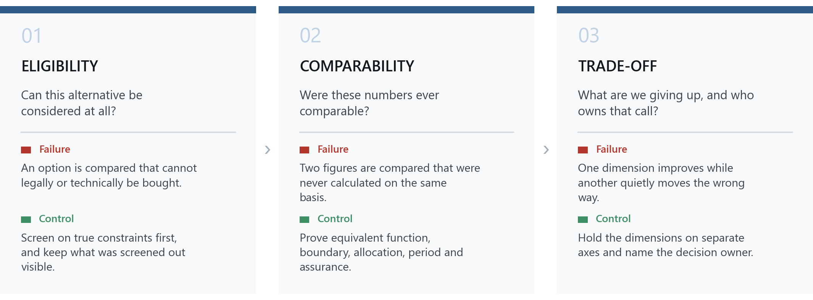

# Sustainable Raw Material Benchmarking

**Decision-support framework and analytics prototype for benchmarking sustainable
raw material alternatives in procurement.**


> **All data in this repository is synthetic.** No real company, supplier, material,
> price, PCF figure or tender appears anywhere in it. See
> [`PROJECT_SPEC.md`](PROJECT_SPEC.md) for the full scope and the explicit exclusions.

---

## Why this exists

A PCF value is a measurement. **It is not yet a sourcing decision.**

Procurement teams increasingly hold carbon figures for the materials they buy, and
still cannot act on them: the number arrives without the technical status of the
alternative, without the evidence behind it, and without the cost consequence of
switching. The common shortcut — folding everything into one sustainability score —
destroys exactly the information the buyer needs, because it hides which dimension
moved and why.

This project translates sustainability information into decision-useful procurement
information **while keeping the trade-offs visible**. For one material need it asks:
which approved alternatives are worth a closer look, and what would switching cost in
euros and in kilograms of CO₂e?

Cost and carbon are reported side by side. The trade-off is left for a person to decide.

---

## At a glance

### 1 · A multidimensional benchmark



Ten success dimensions on a common five-level scale, each read against a benchmark
rather than combined with the others. **The dimensions stay separate: no weighting is
applied, no total is formed and no ranking is derived.** The values shown are
illustrative examples, not empirical assessments.
→ [Paper, Figure 1](Paper/sustainable_raw_material_benchmarking.pdf)

### 2 · The whole portfolio on one surface



Portfolio decision surface — cost and carbon performance stay visible together with
technical eligibility and evidence quality. Colour compares each material with the
incumbent **of its own case**, and each case is an independent decision. Missing PCF
shows as *n/a*, never as zero. It is a screen, not a league table.
→ [Paper, Figure 5](Paper/sustainable_raw_material_benchmarking.pdf)

### 3 · Where the decision actually lands



The point of the method, in one case. The two alternatives furthest into the
better-on-both quadrant are both technically blocked and cannot be bought today. The
only eligible improvement is a fraction of the apparent opportunity. **Performance
cannot buy eligibility** — which is why eligibility is a gate and not a score.
→ [Paper, Figure 6](Paper/sustainable_raw_material_benchmarking.pdf)

---

## The decision logic

**Eligibility → Comparability → Evidence → Trade-off → Decision**

An ordering constraint, not a workflow: a later stage cannot repair an earlier one.



*Three of the five stages, with the failure mode each one prevents.*

The rules that follow from it are methodological commitments, not preferences:

- **Technical eligibility is a gate, not a score** — a non-approved alternative stays
  visible with its reason, and no cost or carbon advantage overrides it.
- **Missing PCF stays missing** — never zero, never imputed. If absence became zero,
  the supplier who discloses least would look like the best performer.
- **Evidence travels beside the number** — provenance, reference year and confidence
  tier live in their own columns and are never blended into the value.
- **Cost and carbon stay separate** — reported side by side, never merged.
- **No composite score, no weighting, no cross-case ranking.**

---

## What is in here

| | |
|---|---|
| **A method** | eligibility → comparability → evidence → trade-off → decision, written up in [`Paper/`](Paper/) |
| **A synthetic dataset** | 25 supplier/material combinations across five comparison cases, carrying realistic naming drift, mixed units and a missing PCF |
| **A pipeline** | pandas in [`src/`](src/) — validate, harmonise, consolidate, log every data-quality finding |
| **A Power BI report** | three pages over 21 measures, authored as text through the PBIP/PBIR project format in [`powerbi/`](powerbi/) |
| **An input contract** | [`docs/DATA_DICTIONARY.md`](docs/DATA_DICTIONARY.md) and ready-to-edit templates in [`data/templates/`](data/templates/) |
| **A management deck** | 17-slide report in [`report/design_pilot/`](report/design_pilot/) |

## Explore the project

| | |
|---|---|
| 📄 **Paper** | [`Paper/sustainable_raw_material_benchmarking.pdf`](Paper/sustainable_raw_material_benchmarking.pdf) |
| 📊 **Power BI report** | [`powerbi/`](powerbi/) · setup in [`docs/POWER_BI_SETUP.md`](docs/POWER_BI_SETUP.md) |
| 🖥 **Management presentation** | [`report/design_pilot/`](report/design_pilot/) |
| 🧪 **Synthetic dataset** | [`data/raw/`](data/raw/) · output in [`data/processed/`](data/processed/) |
| 🔌 **Bring your own data** | [`docs/BYOD.md`](docs/BYOD.md) |
| 📘 **Data dictionary** | [`docs/DATA_DICTIONARY.md`](docs/DATA_DICTIONARY.md) |

This is a **demonstration and reference implementation**, not a product. Run it on the
synthetic data shipped here, or connect your own through the documented BYOD workflow.

---

## Quick start

Python 3.10 or later, one dependency.

```
pip install -r requirements.txt

python src/validate.py        # check the inputs against the contract
python src/transform.py       # build data/processed/ from data/raw/
python src/validate_demo.py   # regression test — synthetic demonstration only
```

`transform.py` is deterministic: run it twice and you get byte-identical output. It
writes `consolidated_material_benchmark.csv` (one row per material, 31 columns) and
`data_quality_log.csv` (one row per finding).

### Running it on your own data

No code changes are required. Copy [`data/templates/`](data/templates/), replace the
example rows, and point the scripts at your folder:

```
python src/validate.py  --raw data/mycompany --ref data/mycompany
python src/transform.py --raw data/mycompany --ref data/mycompany --out data/mycompany/processed
```

Then open the Power BI project and point its `DataFilePath` parameter at your processed
file — [`docs/POWER_BI_SETUP.md`](docs/POWER_BI_SETUP.md).

[`docs/BYOD.md`](docs/BYOD.md) walks through it step by step and lists the known
limitations. `validate_demo.py` is the regression test for the shipped synthetic data
only and will fail on yours by design.

## Repository structure

```
data/raw/           three synthetic source extracts, deliberately inconsistent
data/reference/     mapping tables that reconcile the inconsistencies
data/processed/     the consolidated output, committed so it can be inspected
data/templates/     the same seven files, empty of demo content, for your data
src/                validate.py, transform.py, validate_demo.py
docs/               input contract, BYOD guide and Power BI setup
powerbi/            PBIP/PBIR project — the authoritative report source
Paper/              the written paper (LaTeX source and PDF)
report/             the management report deck and its generator
validation/         the ground truth the demonstration regression test uses
```

## How the rules are enforced

`validate.py` checks every commitment listed above, plus the structural conditions the
method depends on:

- **Exactly one incumbent per comparison case** — every delta is measured against it,
  so two incumbents or none makes the case meaningless.
- **Cases are independent** — nothing is compared or aggregated across them.
- Missing PCF stayed missing, ineligible alternatives are still present, the incumbent
  sits at zero delta, and no score, rank or weight column has appeared in the output.

## The Power BI report

Three pages — **Executive / Portfolio Overview**, **Material Benchmark & Decision
Analysis**, **Opportunity & Risk Heatmap** — over 21 measures.

The report is developed **programmatically through the PBIP/PBIR project format**, which
keeps every page, visual, measure and query reviewable as text and diffable in Git.
`powerbi/*.pbip` together with the `.Report/` and `.SemanticModel/` folders is the
authoritative source; a `.pbix` is a build output, never the source.

It reads one file — the processed CSV — located by a single Power Query parameter,
`DataFilePath`. Setting that parameter is the only change a new user makes; no M code
needs editing. See [`docs/POWER_BI_SETUP.md`](docs/POWER_BI_SETUP.md) for the
walkthrough and [`docs/POWER_BI_INPUT_CONTRACT.md`](docs/POWER_BI_INPUT_CONTRACT.md)
for the contract and the failure modes.

## Author

Csaba Bakay.

## License

The software, Power BI source files, technical utilities and synthetic demonstration
data are licensed under the **MIT License** — see [`LICENSE`](LICENSE).

The written paper ([`Paper/`](Paper/)) and the presentation deck ([`report/`](report/))
are **© 2026 Csaba Bakay, all rights reserved**. Those two documents are **not** covered
by the MIT License; the scripts that generate them are.

To cite this work, see [`CITATION.cff`](CITATION.cff).
